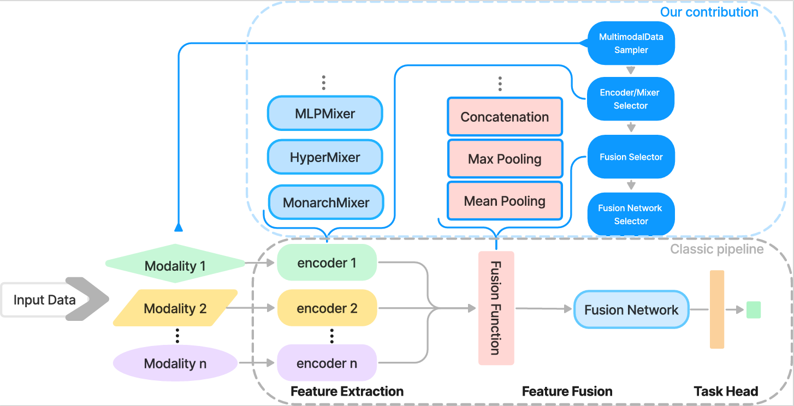
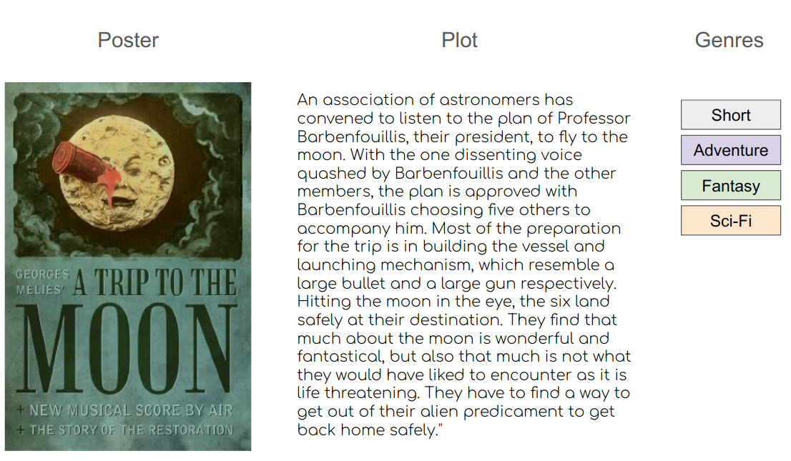
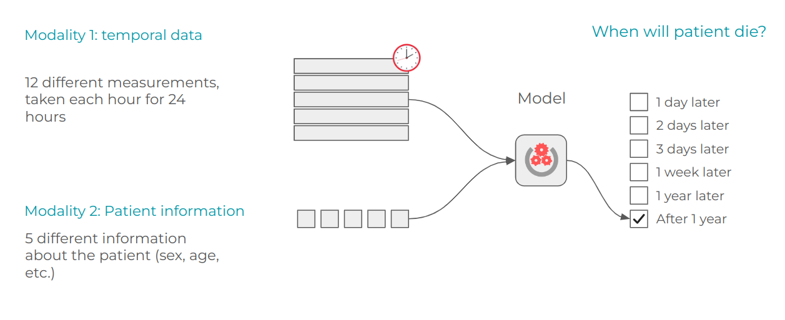
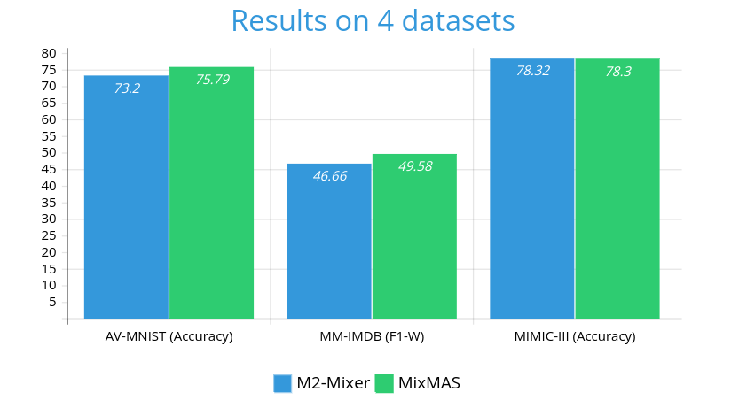

<h3 align="center">MixMAS</h3>

<p align="center">
  An official implementation for paper: "MixMAS: A Framework for Sampling-Based Mixer Architecture Search for Multimodal Fusion and Learning"
  <br/>
  <br/>

## Table Of Contents

* [About the Project](#about-the-project)
* [Built With](#built-with)
* [Getting Started](#getting-started)
    * [Prerequisites](#prerequisites)
    * [Installation](#installation)
* [Usage](#usage)
* [Hyperparameters](#hyperparameters)

## About The Project



In this paper, we propose MixMAS, a framework for Sampling-Based Mixer Architecture Search for Multimodal Fusion and
Learning. Our framework automatically selects the adequate MLP-based architecture for a given multimodal machine
learning task (MML).

## Built With

* [Python](https://www.python.org/)
* [PyTorch](https://pytorch.org/)
* [PyTorch-Lightning](https://www.pytorchlightning.ai/index.html)

## Getting Started

### Prerequisites

python 3.11 or higher

### Installation

```bash
pip install -r requirements.txt
```

## Usage

```bash
python run.py
```

## Datasets

### AV-MNIST
[AV-MNIST](https://github.com/slyviacassell/_MFAS/tree/master) is a 
multimodal dataset, formed by combining the MNIST and FSDD datasets
which is used
for digit pronunciation. The dataset is divided into 55000 train,
5000 validation and 10000 test instances. Given the near-
perfect performance already achieved by existing uni-modal
models on these datasets, we follow the M2-Mixer setup
to reduce the information in the modalities. Finally, we convert
audio samples to spectrograms.

### MM-IMDB
[MM-IMDB](https://github.com/johnarevalo/gmu-mmimdb) is a multimodal dataset that includes two
modalities, image and text. It combines movie posters and
plots for movie genre classification. The dataset is divided
into 15552 train, 2608 validation, and 7799 test samples
in a stratified manner. We used BERT to generate text
embeddings.



### MIMIC-III

[MIMIC-III](https://physionet.org/content/mimiciii/1.4/)  is a comprehensive clinical database, freely-
available collection of de-identified health data from over
40,000 critical care patients at the Beth Israel Deaconess
Medical Center between 2001 and 2012. The data is organized
into two modalities: Time-series which consists of 12 different
medical measurements of the patients taken each hour for 24
hours; and tabular modality that represents various medical
information about the patient. The train, validation and test
splits are 26093, 3261 and 3261 respectively.


## Experiments and results

We compare MixMAS's performance against M2-Mixer. The hyperparameters of M2-Mixer are as follows:

| Dataset   | Hidden Dim. | Patch Sizes         | Token Dim. | Channel Dim. | Blocks (modality 1/ modality 2 / Fusion) | Params (M) |
|-----------|-------------|---------------------|------------|--------------|------------------------------------------|------------|
| MM-IMDB   | 256         | 16 Image / 512 Text | 32         | 3072         | 4 / 4 / 2                                | 16.7       |
| AV-MNIST  | 128         | 14 Image / 56 Audio | 32         | 3072         | 4 / 4 / 2                                | 8.3        |
| MIMIC-III | 64          | 24 Time-series / -  | 16         | 64           | 1 / 2 / 1                                | 0.029      |

All the blocks in the M2-Mixer are MLP-Mixer blocks.
For MixMAS,
the hyperparameters are the same except for the type of the blocks that will be selected during the micro benchmarking.

The final results are summarized in the chart below:
